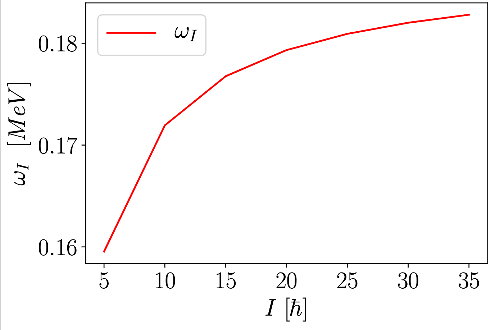

- [Title](#title)
  - [Rezultate numerice - frecventele de wobbling](#rezultate-numerice---frecventele-de-wobbling)
  - [Rezultate numerice - termenul $k_I$](#rezultate-numerice---termenul-mathsemanticsmrowmsubmikmimiimimsubmrowannotation-encodingapplicationx-texk_iannotationsemanticsmathki)
  - [Reprezentare grafica $k_I$](#reprezentare-grafica-mathsemanticsmrowmsubmikmimiimimsubmrowannotation-encodingapplicationx-texk_iannotationsemanticsmathki)
## Rezultate pentru frecventele de wobbling

# Title

Am luat parametrii din fit, si anume:

| $\mathcal{I}_1$ |  $\mathcal{I}_1$ |  $\mathcal{I}_1$ | $\theta$ | $j$|
| :---:|:---:|:---:|:---:|:---:|  
|129|3|52|$-160^o$|11/2|

Cu aceste cifre, am construit conform formulelor din draft termenii $\omega_I$ si $\bar{\omega}_I$. Graficul cu o comparatie intre cele doua curbe se vede mai jos:

## Rezultate numerice - frecventele de wobbling

Cateva rezultate numerice pentru cele doua omegi, ca functie de spin.

| $I$  | $A_I$  | $\omega_I$| $\bar{\omega}_I$|
|:---:|:---:|:---:|:---:|
|   |   |   |   |
5 |0.22549439061745785|0.5087402060338662 |2.2561102501965267|
10|0.19414254414593823| 0.8124363810865354| 4.184741601386564|
15|0.1836919286554317| 1.1175827663622255| 6.084005838158415|
20|0.17846662091017843| 1.423026229423265 |7.973626788952701|
25|0.17533143626302644| 1.7285729645714598| 9.858887837879292|
30|0.17324131316492514| 2.034166144284564 |11.741807465682536|
35|0.17174836809485278| 2.3397837360649922| 13.62332441361412|

## Rezultate numerice - termenul $k_I$

Cateva rezultate numerice pentru $k_I$, ca functie de spin:

| $I$  |$k_I$   |
|:---:|:---:|
|5 |0.15953866968192285|
|10| 0.17193863694322245|
|15| 0.17676195684626297|
|20| 0.1793309864383145|
|25| 0.18092723349439446|
|30| 0.18201538736657027|
|35| 0.18280477185801391|

## Reprezentare grafica $k_I$

